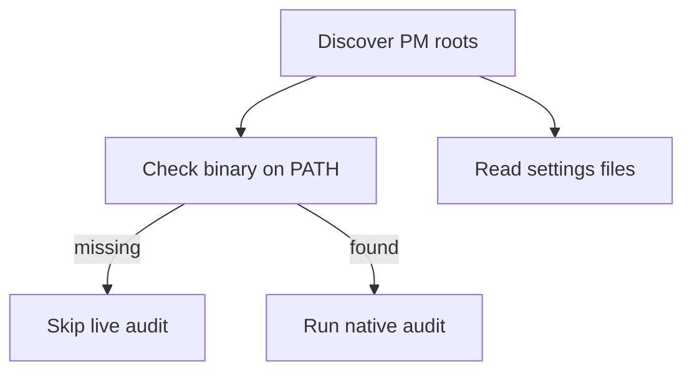

# pkguard

pkguard walks a folder of repos, finds each package-manager root, and audits it. `scan` is read-only and never writes files.

Docs and the product page live at [pkguard.dev](https://pkguard.dev).

As of 1.0.0 pkguard is a Rust binary (workspace in `crates/`).

## How a scan runs

Each project gets a binary check, a settings read, then a vulnerability scan if the binary is there. Settings never call the package manager. The scan does.



Discovery streams results as it walks: projects are audited concurrently while the walk is still running. It detects npm, pnpm, yarn Berry, bun, uv, cargo, bundler, and composer roots; Yarn v1 and Poetry, pip, or Pipenv projects get flagged rather than a live audit.

A missing binary does not skip settings. You still get the file findings plus a `pm.missing-binary` warning. Only that manager's live audit command is skipped.

**Port status:** the settings checks and native advisory audit are live for **npm**. The other managers are detected and reported, and their checks are being ported family by family.

## Install

Build from source (requires a Rust toolchain):

```bash
cargo install --path crates/pkguard
```

Homebrew tap and prebuilt release binaries are coming with the distribution cutover. The old npm package (named `mailclad`, ≤ 0.1.x) is the Bun build and does not match these docs.

## Usage

```bash
pkguard scan [path]                # read-only audit, defaults to the current directory
pkguard scan . --preset strict     # relaxed | standard | strict
pkguard scan . --format json       # machine-readable output (schemaVersion 2)
pkguard scan . --jobs 4            # max concurrent audits (default: min(cpus*2, 16))
pkguard scan . --refresh           # ignore cached advisory results, re-fetch
pkguard scan . --no-cache          # disable the advisory cache entirely
pkguard scan . -q                  # suppress progress output
```

Exit code `0` means every project passed. `1` means a policy failure, either settings drift or an advisory at or above the preset's gate. `2` means the run was incomplete: a missing binary, an audit subprocess died, or no projects were found.

Advisory results are cached by lockfile digest in the platform cache dir (override with `PKGUARD_CACHE_DIR`).

## Configuration

Config is TOML, layered field by field. Later layers win, and flags win over files:

1. user config: `config.toml` in the platform config dir (`~/.config/pkguard/` on Linux, `~/Library/Application Support/dev.pkguard.pkguard/` on macOS)
2. `.pkguard.toml` at the scan root
3. `.pkguard.toml` in an individual repo

```toml
preset = "standard"          # relaxed | standard | strict
managers = ["npm", "cargo"]  # limit which managers are audited
jobs = 8

[policy]                     # overrides the preset's defaults
ignore_scripts = true
min_release_age_days = 3
require_lockfile = true
require_pm_pin = true
audit_level = "high"         # advisory gate: info | low | moderate | high | critical
registry = "https://npm.corp.example/"

[agentic]
enabled = true               # report agentic-hygiene findings (default: true)
apply = false                # let a future fix command write them (default: false)

[manager.npm]                # per-manager override, beats [policy]
audit_level = "critical"
```

Unknown keys are rejected, so typos fail loudly instead of being ignored.

Set `registry` when installs should go through a company proxy; a committed pin that does not match emits `registry.mismatch`. Leave it unset and any pinned registry still passes.

### Presets

| | relaxed | standard (default) | strict |
|---|---|---|---|
| advisory gate | critical | high | moderate |
| install scripts restricted | no | yes | yes |
| release-age gate | off | 1 day | 14 days |
| lockfile required | yes | yes | yes |
| packageManager pin required | no | yes | yes |

## What it checks

Checks are organized by **check family**, not by manager: one deep module per question (scripts, release-age gate, lockfile, registry pin, audit gate, source restrictions, packageManager pin), with per-manager variation passed in as data.

For npm today that means, read from `.npmrc` and `package.json`:

| Family | Settings |
|---|---|
| install scripts | `ignore-scripts`, or `allowScripts` + `strict-allow-scripts`; `dangerously-allow-all-scripts` must not be `true` |
| source restrictions | `allow-git` / `allow-remote`; `allow-file` / `allow-directory` must not be `all` |
| release-age gate | `min-release-age` (days) |
| audit gate | `audit-level` must meet the preset's gate |
| lockfile | `package-lock.json` must be present |
| registry pin | `registry` in `.npmrc` |
| manager pin | `packageManager` in `package.json` must start with `npm@` |

Relying on a safe default instead of pinning it is reported as `info` (`moderate` under strict) rather than a failure. Finding codes are unchanged from the previous build, so anything keying off codes keeps working.

## Advisory audits

When the manager binary is present, pkguard shells out to the native audit (`npm audit --json` for npm) and reports advisories at or above the preset's gate. Results are cached by lockfile digest; pass `--refresh` or `--no-cache` to bypass.

## Development

Requires a stable Rust toolchain.

```bash
cargo test              # run the test suite
cargo clippy            # lint
cargo fmt               # format
cargo run -p pkguard -- scan .
```

The workspace is two crates: `pkguard-core` (discovery, config, checks, advisory pipeline) and `pkguard` (the CLI: clap, rendering, progress).

The docs site (`site/`, Astro) builds from a checked-in catalog dumped from the binary (`pkguard dump-catalog`); CI fails if it goes stale.

## Releasing

Pushing a `v*` tag runs `.github/workflows/release.yml`: tests, a GitHub release, and per-platform binaries built on a runner matrix. cargo-dist and release-plz (plus the Homebrew tap) replace this at the distribution cutover.

## License

MIT
