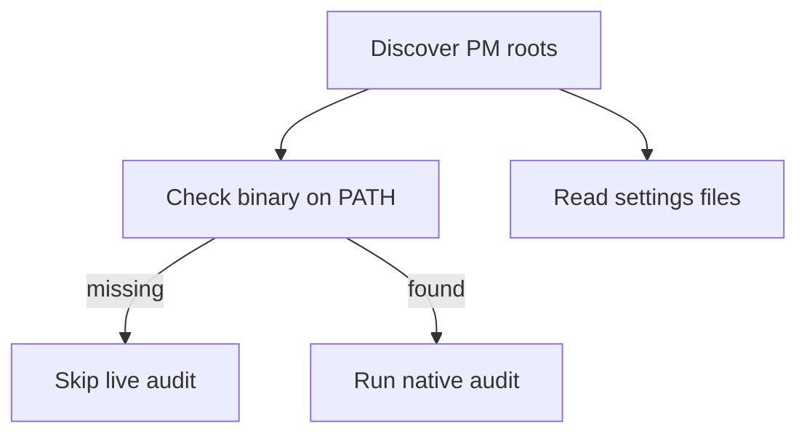

# pkguard

pkguard walks a folder of repos, finds each package-manager root, and audits it. `scan` is read-only and never writes files.

Docs and the product page live at [pkguard.dev](https://pkguard.dev).

As of 1.0.0 pkguard is a Rust binary (workspace in `crates/`).

## How a scan runs

Each project gets a binary check, a settings read, then a vulnerability scan if the binary is there. Settings never call the package manager. The scan does.



Discovery streams results as it walks: projects are audited concurrently while the walk is still running. It detects npm, pnpm, yarn Berry, bun, uv, cargo, bundler, and composer roots; Yarn v1 and Poetry, pip, or Pipenv projects get flagged rather than a live audit.

A missing binary does not skip settings. You still get the file findings plus a `pm.missing-binary` warning. Only that manager's live audit command is skipped.

**Port status:** settings checks and native advisory audits are live for **npm**, **pnpm**, **yarn Berry**, **bun**, **uv**, **cargo**, **composer**, and **bundler**. Yarn v1 is `pm.unsupported`. Poetry, pip, and Pipenv report `python.not-uv` instead of a live audit.

## Install

Build from source (requires a Rust toolchain):

```bash
cargo install --path crates/pkguard
```

Homebrew tap and prebuilt release binaries are coming with the distribution cutover.

## Usage

```bash
pkguard init                       # write the user config (refuses to overwrite)
pkguard init --local               # write .pkguard.toml in the current directory
pkguard init --force               # overwrite an existing file
pkguard scan [path]                # read-only audit, defaults to the current directory
pkguard scan . --preset strict     # relaxed | standard | strict
pkguard scan . --format json       # machine-readable output (schemaVersion 2)
pkguard scan . --jobs 4            # max concurrent audits (default: min(cpus*2, 16))
pkguard scan . --refresh           # ignore cached advisory results, re-fetch
pkguard scan . --no-cache          # disable the advisory cache entirely
pkguard scan . -q                  # suppress progress output
```

Exit code `0` means every project passed. `1` means a policy failure, either settings drift or an advisory at or above the preset's gate. `2` means the run was incomplete: a missing binary, an audit subprocess died, or no projects were found.

Advisory results are cached by lockfile digest in the platform cache dir (override with `PKGUARD_CACHE_DIR`).

## Configuration

Config is TOML, layered field by field. Later layers win, and flags win over files:

1. user config: `config.toml` in the platform config dir (`~/.config/pkguard/` on Linux, `~/Library/Application Support/dev.pkguard.pkguard/` on macOS). `pkguard init` writes this; `PKGUARD_CONFIG_DIR` overrides the directory.
2. `.pkguard.toml` at the scan root (`pkguard init --local`)
3. `.pkguard.toml` in an individual repo

```toml
preset = "standard"          # relaxed | standard | strict
managers = ["npm", "cargo"]  # limit which managers are audited
jobs = 8

[policy]                     # overrides the preset's defaults
ignore_scripts = true
min_release_age_days = 3
require_lockfile = true
require_pm_pin = true
audit_level = "high"         # advisory gate: info | low | moderate | high | critical
registry = "https://npm.corp.example/"

[agentic]
enabled = true               # report agentic-hygiene findings (default: true)
apply = false                # let a future fix command write them (default: false)

[manager.npm]                # per-manager override, beats [policy]
audit_level = "critical"
```

Unknown keys are rejected, so typos fail loudly instead of being ignored.

Set `registry` when installs should go through a company proxy; a committed pin that does not match emits `registry.mismatch`. Leave it unset and any pinned registry still passes.

### Presets

| | relaxed | standard (default) | strict |
|---|---|---|---|
| advisory gate | critical | high | moderate |
| install scripts restricted | no | yes | yes |
| release-age gate | off | 1 day | 14 days |
| lockfile required | yes | yes | yes |
| packageManager pin required | no | yes | yes |

## What it checks

Checks are organized by **check family**, not by manager: one deep module per question (scripts, release-age gate, lockfile, registry pin, audit gate, source restrictions, packageManager pin), with per-manager variation passed in as data.

For npm today that means, read from `.npmrc` and `package.json`:

| Family | Settings |
|---|---|
| install scripts | `ignore-scripts`, or `allowScripts` + `strict-allow-scripts`; `dangerously-allow-all-scripts` must not be `true` |
| source restrictions | `allow-git` / `allow-remote`; `allow-file` / `allow-directory` must not be `all` |
| release-age gate | `min-release-age` (days) |
| audit gate | `audit-level` must meet the preset's gate |
| lockfile | `package-lock.json` must be present |
| registry pin | `registry` in `.npmrc` |
| manager pin | `packageManager` in `package.json` must start with `npm@` |

For pnpm, the same families are read from `pnpm-workspace.yaml` (not `.npmrc`):

| Family | Settings |
|---|---|
| install scripts | `dangerouslyAllowAllBuilds` must not be true; prefer an explicit `allowBuilds` map; `strictDepBuilds` must not be false |
| source restrictions | `blockExoticSubdeps` must not be false |
| release-age gate | `minimumReleaseAge` in minutes (pnpm 11 defaults to 1440); `minimumReleaseAgeStrict` must not be false; under strict, `minimumReleaseAgeIgnoreMissingTime` must be false |
| audit gate | `audit.level` (or `auditLevel`) must meet the preset's gate |
| lockfile | `pnpm-lock.yaml` must be present; `trustLockfile` must not be true; `verifyDepsBeforeRun` must be `error` |
| provenance | `trustPolicy` must be `no-downgrade`; `trustPolicyIgnoreAfter` at least 90 days |
| registry pin | `registry` or `registries.default` |
| manager pin | `packageManager` in `package.json` must start with `pnpm@` |

For yarn Berry, the same families are read from `.yarnrc.yml`:

| Family | Settings |
|---|---|
| install scripts | `enableScripts` must be false (Yarn ≥4.14 defaults off) |
| source restrictions | `approvedGitRepositories` must be an empty allowlist (Yarn ≥4.14) |
| integrity | `checksumBehavior` must be `throw` if set; `enableStrictSsl` / `enableHardenedMode` must not be false |
| release-age gate | `npmMinimalAgeGate` (Yarn ≥4.12 defaults to 1 week); `npmPreapprovedPackages` must not be `*` |
| audit gate | `audit` / `npmAudit` / `enableNpmAudit` must not be false |
| lockfile | `yarn.lock` must be present |
| registry pin | `npmRegistryServer` |
| manager pin | `packageManager` must be `yarn@` major ≥ 2 |

For bun, from `bunfig.toml`:

| Family | Settings |
|---|---|
| install scripts | restrict via `trustedDependencies`, `[install.security]`, or `ignoreScripts`; `install.auto` must not re-enable them |
| release-age gate | `install.minimumReleaseAge` in seconds |
| lockfile | `bun.lock` or `bun.lockb` |
| registry pin | `install.registry` or `install.registry.url` |

For uv, from `[tool.uv]` / `uv.toml`:

| Family | Settings |
|---|---|
| release-age gate | `exclude-newer` must meet the preset (days, duration, or date); `exclude-newer-package` must not be `*` |
| extra indexes | under strict, extra indexes require `index-strategy = "first-index"` |
| malware | `audit.malware-check` must be true on uv ≥ 0.11.31 |
| lockfile | `uv.lock` must be present |

Poetry, pip, and Pipenv emit a single high `python.not-uv` finding. A leftover `poetry.lock` beside uv is `lockfile.leftover`.

For cargo, from `.cargo/config.toml`:

| Family | Settings |
|---|---|
| lockfile | `Cargo.lock` must be present |
| release-age gate | `install.minimum-release-age` |

For composer, from `composer.json`:

| Family | Settings |
|---|---|
| lockfile | `composer.lock` must be present |
| install scripts | `config.allow-plugins` must not be `true` |
| TLS / registry | `secure-http` on, `disable-tls` off; repository URLs must be https |
| audit policy | advisories must not be `ignore`; `policy.advisories.block` and `policy.malware.block` default on |
| source | `source-fallback` must not be true |

For bundler, from `.bundle/config`:

| Family | Settings |
|---|---|
| lockfile | `Gemfile.lock` must be present |
| release-age gate | `BUNDLE_COOLDOWN` in days |

Relying on a safe default instead of pinning it is reported as `info` (`moderate` under strict) rather than a failure. Finding codes are unchanged from the previous build, so anything keying off codes keeps working.

## Advisory audits

When the manager binary is present, pkguard shells out to the native audit (`npm audit --json`, `pnpm audit --json`, `yarn npm audit --json`, `bun audit --json`, `uv audit`, `cargo audit --json`, `composer audit`, `bundle-audit check`) and reports advisories at or above the preset's gate. Results are cached by lockfile digest; pass `--refresh` or `--no-cache` to bypass.

## Development

Requires a stable Rust toolchain.

```bash
cargo test              # run the test suite
cargo clippy            # lint
cargo fmt               # format
cargo run -p pkguard -- scan .
```

The workspace is two crates: `pkguard-core` (discovery, config, checks, advisory pipeline) and `pkguard` (the CLI: clap, rendering, progress).

The docs site (`site/`, Astro) builds from a checked-in catalog dumped from the binary (`pkguard dump-catalog`); CI fails if it goes stale.

## Releasing

Pushes to `main` that change the crates (or **Publish** → *Run workflow*) run `.github/workflows/publish.yml`. That job bumps `[workspace.package]` from conventional commits, writes `CHANGELOG.md`, tags, and pushes. Commits whose message contains `[skip publish]` or `[skip ci]` are skipped; the release commit itself is `chore(release): vX.Y.Z [skip publish]`.

Publish then calls `.github/workflows/release.yml`: tests, a GitHub release whose notes come from the matching `CHANGELOG.md` section (or generated notes if that section is empty), and per-platform binaries. A `v*` tag that is not from that auto-release commit, or **Release** → *Run workflow*, does the same.

The publish job needs `DEPLOY_KEY` so the release commit can land on `main` under branch rulesets. There is no npm publish; cargo-dist, release-plz, and the Homebrew tap still come later.

## License

MIT
