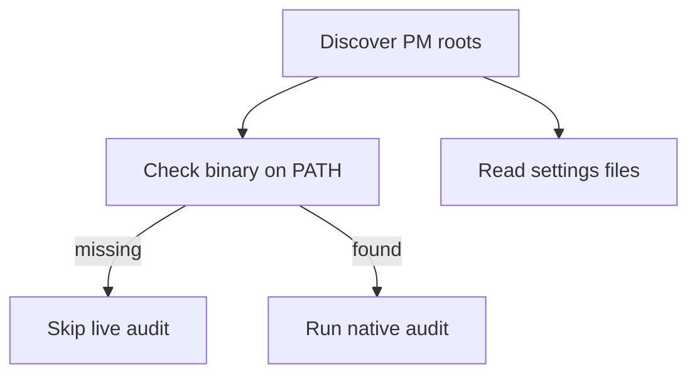

# mailclad

mailclad walks a folder of repos, finds each package-manager root, and audits it. It does not write files unless you pass an apply flag.

Docs and the product page live at [mailclad.dev](https://mailclad.dev). Command flags on that site are generated from the CLI catalog in this repo.

npm, pnpm, yarn Berry, bun, uv, cargo, bundler, and composer all go through the same path. Yarn v1 and Poetry, pip, or Pipenv projects get flagged. They do not get a live audit.

## How an audit runs

Each project gets a binary check, a settings read, then a vulnerability scan if the binary is there. Settings never call the package manager. The scan does.



Discovery finds the roots. Preflight looks for `npm`, `pnpm`, `yarn`, `bun`, `uv`, `cargo`, `bundle-audit`, or `composer` on `PATH`. Settings then read that manager's committed config file.

A missing binary does not skip settings. You still get the file findings plus a `pm.missing-binary` warning. Only that manager's live `audit` command is skipped.

Leftover lockfiles and Poetry, pip, or Pipenv never need a binary for this step.

## Install

### From npm (requires [Bun](https://bun.sh))

```bash
bun install -g mailclad
# or
npm install -g mailclad
```

The CLI runs on Bun, so Bun must be on your `PATH` either way.

### Standalone binary (no Bun needed)

Grab the binary for your platform from the [releases page](https://github.com/jackmcpickle/package-manager-security/releases):

- `mailclad-linux-x64` / `mailclad-linux-arm64`
- `mailclad-darwin-x64` / `mailclad-darwin-arm64` (macOS)
- `mailclad-windows-x64.exe`

Fair warning: they're about 100 MB each, since Bun's runtime is baked in.

```bash
curl -fsSL -o mailclad https://github.com/jackmcpickle/package-manager-security/releases/latest/download/mailclad-darwin-arm64
chmod +x mailclad
./mailclad audit .
```

## Usage

```bash
mailclad audit [path]                 # audit only, never writes (default preset: standard)
mailclad audit . --preset strict      # relaxed | standard | strict
mailclad audit . --apply              # write settings fixes (clean git tree required)
mailclad audit . --fix                # same as --apply
mailclad audit . --apply-agentic      # write safe agentic edits only
mailclad audit . --apply-advisories   # upgrade packages with known fixes (no major bumps)
mailclad audit . -i                   # interactive: consent per repo
mailclad audit . --json               # machine-readable output
mailclad audit . --sarif              # SARIF output
mailclad audit . --report out.md      # markdown report
```

Exit code `0` means every project passed. `1` means a policy failure, either settings drift or an advisory at or above the preset's gate. `2` means the run was incomplete: a missing binary, a dirty tree blocked an apply, an audit subprocess died, or no projects were found.

Configuration lives in `~/.config/mailclad/config.toml`, plus `.mailclad.toml` at the scan root or in any repo. The closer file wins, and flags win over files.

Set `registry` when installs should go through a company proxy. `--apply` then writes that URL. A committed pin that does not match emits `registry.mismatch`. Leave it unset and any pinned registry still passes; apply writes `https://registry.npmjs.org/`.

```toml
# ~/.config/mailclad/config.toml or .mailclad.toml
registry = "https://npm.corp.example/"

[yarn]
registry = "https://yarn.corp.example/"
```

This applies to npm, pnpm (`registry` or `registries.default`), yarn (`npmRegistryServer`), and bun (`install.registry`).

The default **standard** preset requires a **1-day** release-age gate (`minReleaseAgeDays: 1`); **strict** requires 14 days, **relaxed** turns the gate off (0 days).

## What it checks

Every manager gets the same four questions: are install scripts restricted, is
there a release-age gate, is the lockfile present, and is the registry pinned.
The settings behind those answers differ per manager:

| | install scripts | release-age gate | lockfile |
|---|---|---|---|
| npm | `ignore-scripts`, or `allowScripts` + `strict-allow-scripts` | `min-release-age` (days) | `package-lock.json` |
| pnpm | `allowBuilds`, `dangerouslyAllowAllBuilds`, `strictDepBuilds` | `minimumReleaseAge` (minutes) | `pnpm-lock.yaml` |
| yarn | `enableScripts` | `npmMinimalAgeGate` (minutes or `7d`) | `yarn.lock` |
| bun | `trustedDependencies` | `minimumReleaseAge` (seconds) | `bun.lock` |
| uv | n/a | `exclude-newer` (date or `"1 day"`) | `uv.lock` |
| cargo | n/a | `minimum-release-age` in `.cargo/config.toml` | `Cargo.lock` |
| bundler | n/a | `BUNDLE_COOLDOWN` in `.bundle/config` | `Gemfile.lock` |
| composer | `allow-plugins` must not be `true` | n/a (Composer has no cooldown yet) | `composer.lock` |

Also checked: pnpm `blockExoticSubdeps`, npm `allow-git` / `allow-remote`, yarn
`checksumBehavior`, `enableStrictSsl` and `enableHardenedMode`, and exclude
lists (`minimumReleaseAgeExclude`, `npmPreapprovedPackages`,
`exclude-newer-package`) that use a bare `*` and so void the gate.

Manager-specific checks beyond the baseline:

| Manager | Setting | What it enforces |
|---|---|---|
| npm | `allow-file`, `allow-directory` | must not be `all` (blocks local-path deps) |
| npm | `allow-scripts-pin` | must be `true` when scripts are restricted |
| npm | `dangerously-allow-all-scripts` | must not be `true` |
| pnpm | `audit.level` | must meet the preset gate (pnpm ≥ 11.16; not boolean `audit: true`) |
| pnpm | `trust-policy` | must be `no-downgrade` (pnpm ≥ 10.21) |
| pnpm | `trustPolicyIgnoreAfter` | at least 90 days / 129600 minutes (pnpm ≥ 10.27) |
| pnpm | `trust-lockfile` | must not be `true` |
| pnpm | `verify-deps-before-run` | must be `error` (pnpm ≥ 10.12) |
| yarn | `approvedGitRepositories` | must block git-sourced deps (yarn ≥ 4.14) |
| uv | `audit.malware-check` | must be `true` (uv ≥ 0.11.31) |
| cargo | `install.minimum-release-age` | duration string meeting the preset (e.g. `"1d"`) |
| bundler | `BUNDLE_COOLDOWN` | days ≥ preset minimum |
| composer | `config.policy` | advisories/malware blocking on; `policy.advisories.audit` must not be `ignore` |
| composer | `secure-http` / `disable-tls` | TLS required; HTTP repository URLs are reported but not rewritten |
| composer | `source-fallback` | must not be `true` (dist must not fall back to source) |

Checks are version-aware. pnpm 11 turns `minimumReleaseAge` on at 1440 minutes
and yarn defaults `npmMinimalAgeGate` to `1w` and `enableScripts` to `false`, so
a missing key on those versions is reported as `info` ("you're relying on a safe
default") rather than `high`. mailclad reads the version from the `packageManager`
field in `package.json`; with no pin it assumes a current release.

## Agentic checks

By default mailclad also warns (`info`) about settings that confuse coding
agents: a committed store or cache path, version overrides, pnpm shameful hoist,
and Yarn or pnpm Plug'n'Play. These never fail the standard gate. `--apply`
does not write them unless `applyAgentic = true` in config. Pass
`--apply-agentic` to write only the safe edits (unset an in-repo cache path,
turn hoist off, set yarn `nodeLinker` to `node-modules`). It never writes a
home-dir store or deletes an override.

`mailclad audit --help` lists each code, what it means, and the caveat.

## Advisory audits

When settings pass, mailclad also scans lockfiles for known vulnerabilities at or
above the preset's advisory gate (`high` for standard, `moderate` for strict,
`critical` for relaxed). It shells out to each manager's native audit where
available:

| Manager | Command |
|---|---|
| npm | `npm audit --json` |
| pnpm | `pnpm audit --json` |
| yarn | `yarn npm audit --json` |
| bun | `bun audit --json` |
| uv | `uv audit --output-format json --frozen` |
| cargo | `cargo audit` |
| bundler | `bundle-audit` |
| composer | `composer audit --format json --locked` |

Poetry, pip, and Pipenv use OSV lookups instead of a native audit command.
Results are cached by lockfile digest; pass `--refresh` or `--no-cache` to bypass.

## Development

Requires [Bun](https://bun.sh) >= 1.2.

```bash
bun install        # install dependencies
bun test           # run the test suite
```

CI runs on GitHub Actions (`.github/workflows/ci.yml`): tests with coverage, lint, and the coverage ratchet.

### Build

```bash
bun run build          # bundle to dist/mailclad.js (the npm bin, runs on Bun)
bun run build:binary   # compile a standalone binary to dist/mailclad for this machine
```

To cross-compile for another platform:

```bash
bun build ./src/main.ts --compile --target=bun-linux-x64 --outfile dist/mailclad-linux-x64
```

Targets: `bun-linux-x64`, `bun-linux-arm64`, `bun-darwin-x64`, `bun-darwin-arm64`, `bun-windows-x64`.

## Releasing

Releases are automated from conventional commits on `main`.

1. **`.github/workflows/publish.yml`** — on push to `main` (when `src/` or `package.json` changes), runs tests, then `commit-and-tag-version` to bump the version, update `CHANGELOG.md`, and push the release commit + tag. Release commits use `[skip ci]` so they don't re-trigger the workflow.
2. **`.github/workflows/release.yml`** — on tag push (`v*`), creates the GitHub release (notes from `CHANGELOG.md`), attaches standalone binaries for all five platforms, and publishes `mailclad` to npm.

Use [Conventional Commits](https://www.conventionalcommits.org/) so release notes are generated correctly:

```text
feat: add uv exclude-newer check
fix(cli): handle missing lockfile in monorepos
feat!: drop yarn v1 support        # major bump
```

To cut a release manually:

```bash
bun run release              # or: bun run release -- --release-as minor
git push --follow-tags
```

### Repository secrets

| Secret | Used by | Purpose |
|---|---|---|
| `DEPLOY_KEY` | publish | SSH deploy key with bypass so the release commit/tag can push to protected `main` |

npm publishing uses [OIDC trusted publishing](https://docs.npmjs.com/trusted-publishers) — no `NPM_TOKEN` secret required. Ensure `jackmcpickle/package-manager-security` → `.github/workflows/release.yml` is configured as a trusted publisher for `mailclad` on npmjs.com.

## License

MIT
